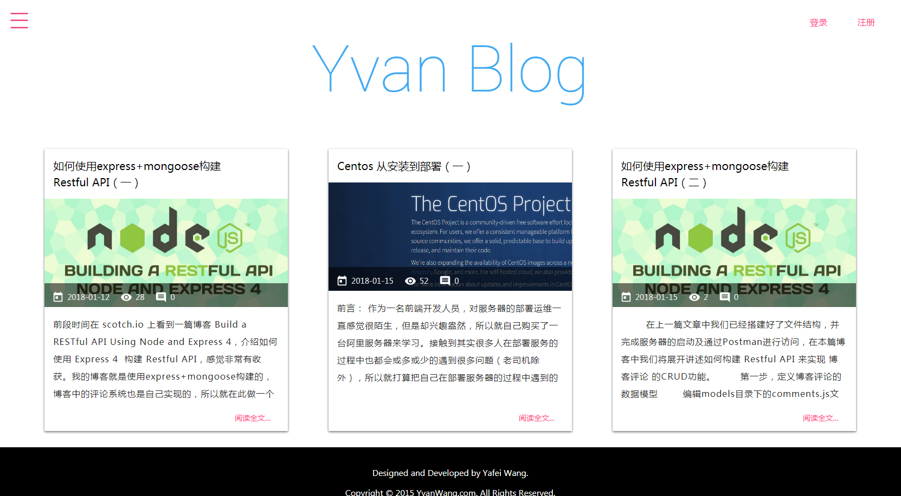
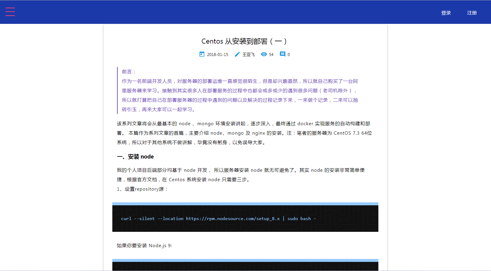
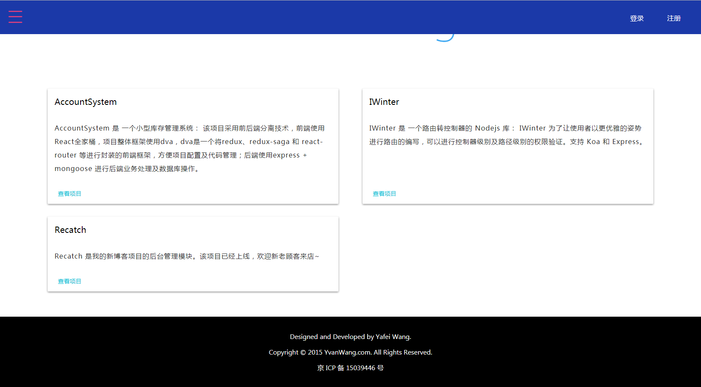
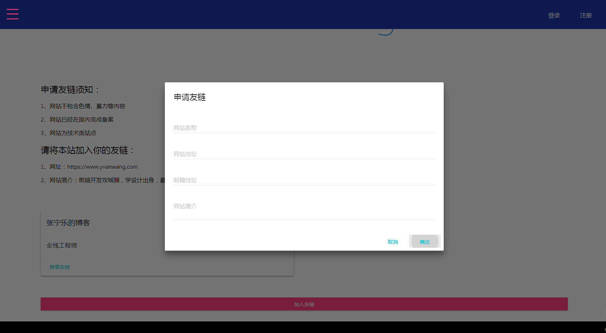

## 个人博客项目的前端展示界面 代号 recatch-ui

该项目为我的个人博客第二版的展示界面，实现功能：</br>
`1.`文章列表页
`2.`文章详情页包含评论模块
`3.`个人项目展示页面
`4.`友链墙，访客可以申请加入友链
`5.`关于小站

[在线地址](https://www.yvanwang.com/)</br>

### 项目技术栈
该项目采用前后端分离技术，前端依然采用 React 系列技术栈，数据管理转用 mobx，包括： </br>
react/mobx/mobx-react-form/react-router v4/material-ui，使用 Typescript 进行代码编写。</br>
使用 docker 进行镜像构建及容器部署</br>

### 项目部分界面
`1.`博客首页</br>



`2.`博客详情页</br>
博客详情页面，包含评论模块</br>



`3.`项目页</br>
该模块主要对个人项目进行展示</br>



`4.`友链墙</br>
友链墙支持自定义增加友链，会在后台对申请的友链进行审核，审核结果会以邮件的方式发送到申请者邮箱中</br>



### 如何运行
`1.` `git clone https://github.com/yvanwangl/recatch-ui.git`</br>
`2.` `cd recatch-ui && npm install`</br>
`3.` `npm run start`</br>

### 项目构建
`1.` 通过 `npm run build` 进行项目构建</br>

### 项目部署
该项目支持两种部署方式：</br>
`1.` 基于node环境部署：`npm run start:prod`</br>
注意： 运行前需要对环境变量进行配置</br>
该方式的部署需要修改根目录下的 ecosystem.config.js 文件</br>

```
env_production: {
    "PROXY_HOST": "localhost",
    "PROXY_PORT": 8082,
    "PORT": 8086,
    "NODE_ENV": "production",
}
```

`2.`部署 docker 容器：</br>
首先构建 docker 镜像，需要在项目根目录下运行：`docker build --rm -f Dockerfile -t recatch-ui:latest .`</br>
然后使用 docker-compose 运行容器：docker-compose up -d</br>
注意： 运行前需要对环境变量进行配置</br>
该方式的部署需要修改根目录下的 docker-compose.yml 文件</br>

```
environment:
    - PROXY_PORT=8082
    - PORT=8086
    - PROXY_HOST=192.168.0.1
```

### 配置参数说明：
PROXY_HOST: 代理服务器地址</br>
PROXY_PORT: 代理服务器端口</br>
PORT: 资源服务器端口</br>

部署模式下，该项目会起一个 node 资源服务器，将以 `/api` 为前缀的请求转发至代理服务器</br>

由于该项目采用前后端分离的方式进行开发，只部署该项目没有后端服务提供数据，所以还需要部署服务项目 [recatch-service](https://github.com/yvanwangl/recatch-service)

> 欢迎Star，有问题请提 issue :)


